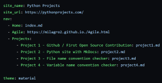

# Project 2 - Phyton site with MkDocs

For project 2 I learned how to make this website using MkDocs. I used this [tutorial](https://www.mkdocs.org/getting-started/).

---
The first thing I did was open Python and run this command in the terminal:
```cmd
pip install mkdocs
```
Next I ran this command to create a new project:
```cmd
mkdocs new my-poject
cd my-project
```
Then I used `mkdocs serve` to get the server running and when I went to `http://127.0.0.1:8000/` in my browser where it displayed the mkdocs website.
By going into the mkdocs.yml file I could change the `site_name` which was immediately visible in the browser. 
