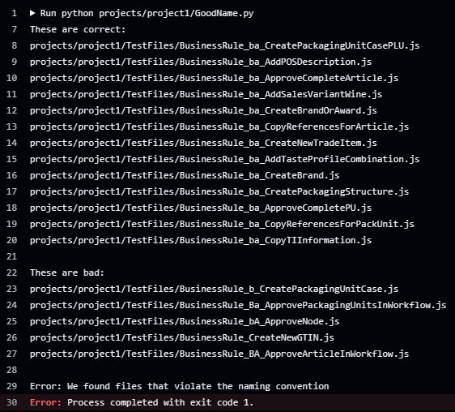

# Project 3 - File name convention checker

In project 3, I wrote a Python script that reads all the filenames and checks if the name is correct or not. The name is correct when it has a specific word in front of it. Then it makes a list of the correct and the incorrect files and gives an error so you know which file names to fix.

 

| The code to check the filenames | The result, sorted filenames |
| -------------- | --------------- |
|  |  |

