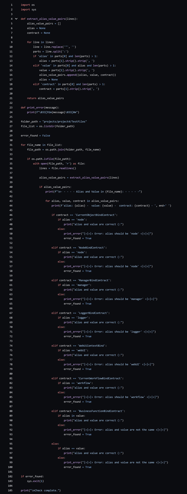
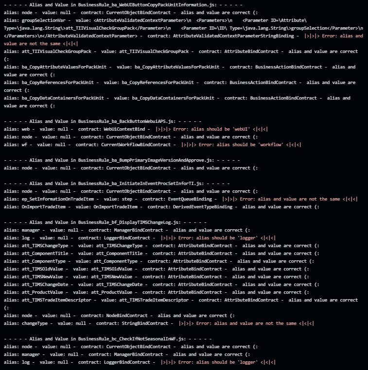

# project 4

In project 4 I wrote a python script that reads the JSON Objects from all the files, than it prints the alias, value and contract. In most cases it just checks if the alias is the same as the value and that it prints 'alias and value are correct (:' but sometimes the alias and the value can be different. That is when the contract has a specific name, for that there are if-statements to apply different rules. 

---

| The code to check the variables | The result, checked variables |
| :--------------: | :---------------: |
|  |    |

---
